# Ascent backend UML

**Architecture snapshot:** 15 September 2026  
**Implementation:** Bun + TypeScript, zero runtime dependencies  
**Source:** [sefuwunder/ascent](https://github.com/sefuwunder/ascent)

Ascent is a local-first project-management application. Its browser client talks only to a Bun HTTP server. The server treats Anytype as the content system of record, while two gitignored JSON files retain configuration, object relationships, and integration state. ClickUp and IMAP are optional server-side integrations.

---

## 1. System context

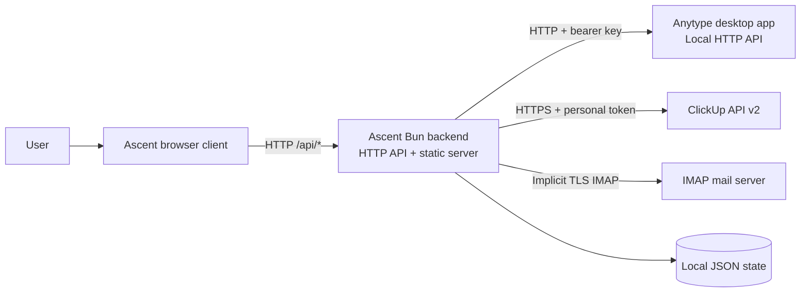

### Architectural boundary

- **Browser client:** renders the overview, project board/table/wiki, setup, imports, and sync controls. It never receives the Anytype API key, ClickUp token, or IMAP password.
- **Bun backend:** owns routing, validation, orchestration, synchronization, link integrity, error translation, and static-file delivery.
- **Anytype:** owns project, task, and wiki content as native objects.
- **Local JSON state:** owns associations and integration metadata, not canonical content.
- **ClickUp and IMAP:** are optional external sources reached only through backend adapters.

---

## 2. Backend component view

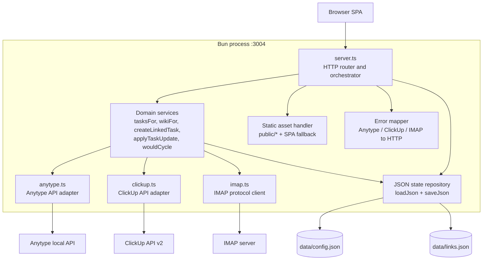

### Component responsibilities

| Component | Owns | Does not own |
|---|---|---|
| `server.ts` | Routes, workflows | Remote protocols |
| `anytype.ts` | Anytype normalization | Project membership |
| `clickup.ts` | ClickUp mapping | Sync snapshots |
| `imap.ts` | IMAP parsing | Task creation |
| `config.json` | Pairing and space | User content |
| `links.json` | Links and sync state | Canonical content |

---

## 3. Deployment view

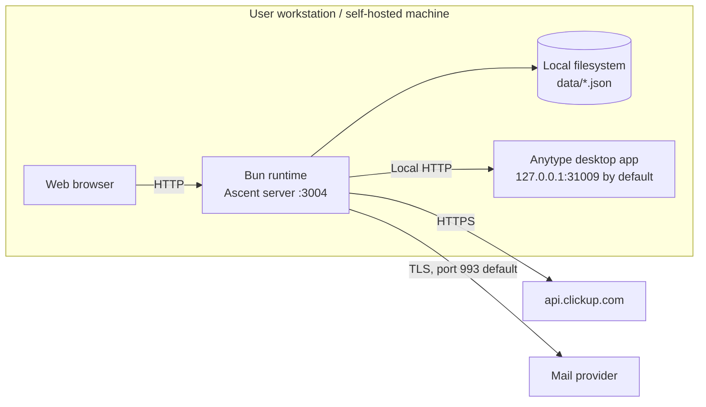

**Deployment constraint:** the default Anytype base URL is loopback, so Anytype and the Ascent backend normally run on the same machine. `ANYTYPE_BASE_URL`, `ANYTYPE_VERSION`, and `PORT` can override their defaults.

---

## 4. Domain and persistence model

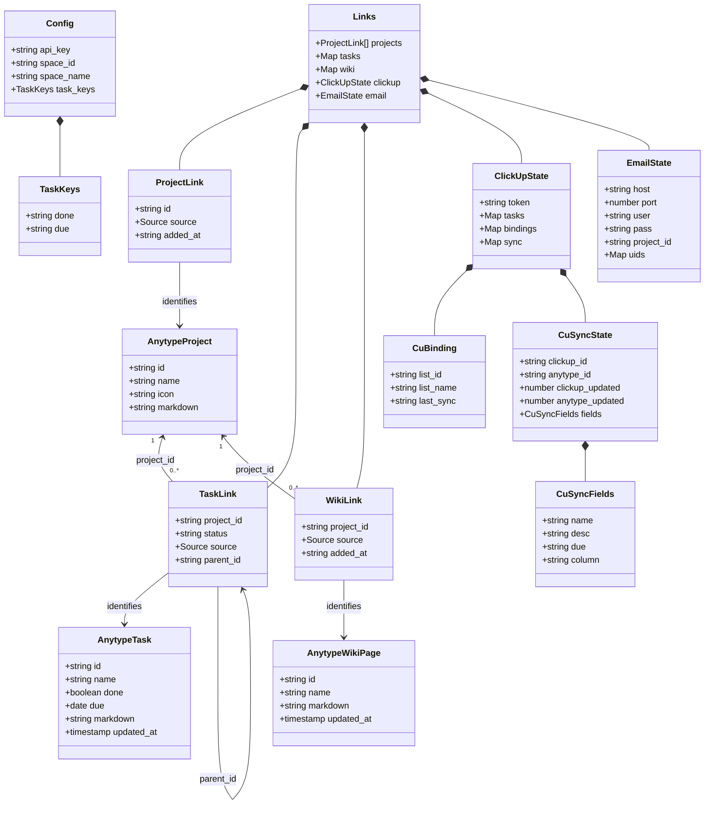

### Ownership rules

- **Canonical content:** names, descriptions, markdown bodies, done flags, due dates, icons, and update timestamps live in Anytype objects.
- **Ascent relationships:** project membership, kanban status, prerequisite parentage, source markers, and integration bindings live in `links.json`.
- **Configuration:** the Anytype key, selected space, and discovered task-property keys live in `config.json`.
- **Secrets:** the Anytype API key is stored in `config.json`; ClickUp and IMAP credentials are stored in `links.json`. Both files are server-side and gitignored.
- **Source semantics:** `ascent` means Ascent created the object; `imported` means Ascent only linked an existing/external object.

### Object lifecycle

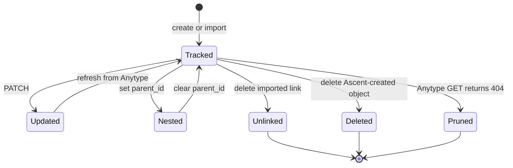

Imported projects, tasks, and wiki pages are unlinked rather than deleted from Anytype. Ascent-created tasks and wiki pages may be deleted from Anytype. Deleting a project removes its Ascent links but deliberately leaves its linked task and wiki objects in Anytype.

---

## 5. HTTP API surface

| Area | Representative routes | Purpose |
|---|---|---|
| Setup | `/api/status`, `/api/pair/*` | Pair with Anytype |
| Config | `/api/spaces`, `/api/config` | Select a space |
| Overview | `/api/overview` | Aggregate workload |
| Projects | `/api/projects/*` | CRUD and import |
| Tasks | `/api/tasks/*` | CRUD and nesting |
| Wiki | `/api/wiki/*` | CRUD and import |
| ClickUp | `/api/integrations/clickup/*` | Import and sync |
| Email | `/api/integrations/email/*` | Starred-mail import |
| Search | `/api/search` | Anytype picker data |

All API errors are returned as JSON. Adapter-specific failures are translated centrally: authentication failures become actionable `401` responses, unavailable upstreams become `502`, missing Anytype objects become `404`, and unexpected failures become `500`.

---

## 6. Anytype pairing and space selection

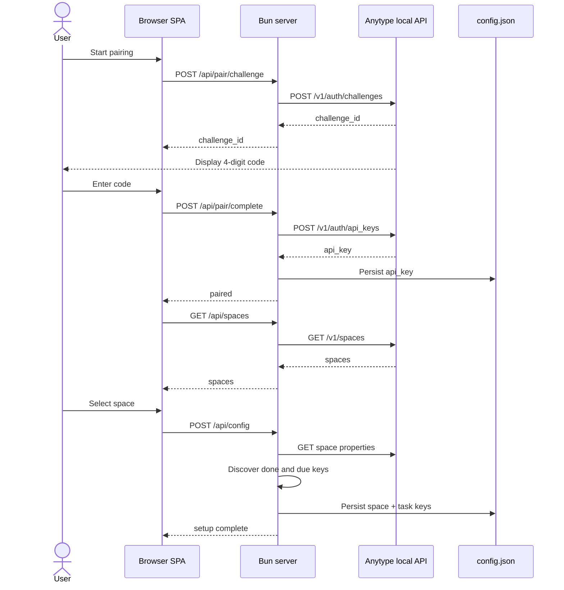

The backend validates that the pairing code is exactly four digits. Property discovery avoids assuming stable relation keys: it matches the selected space's definitions by name and format, then falls back to `done` and `due_date`.

---

## 7. Project and task write path

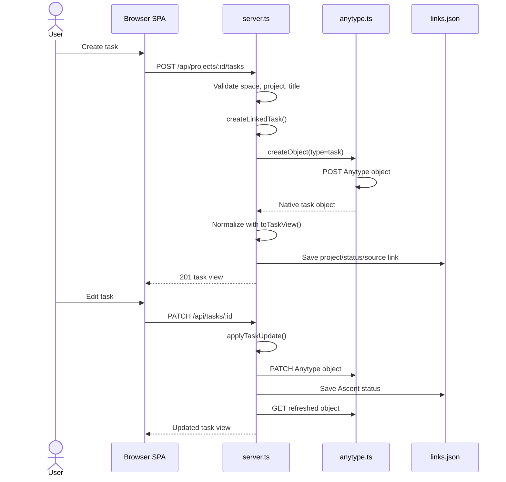

`createLinkedTask()` and `applyTaskUpdate()` are shared orchestration paths. Manual edits, ClickUp imports, ClickUp pulls, and email imports therefore use the same native Anytype representation and status semantics.

---

## 8. Read hydration and repair

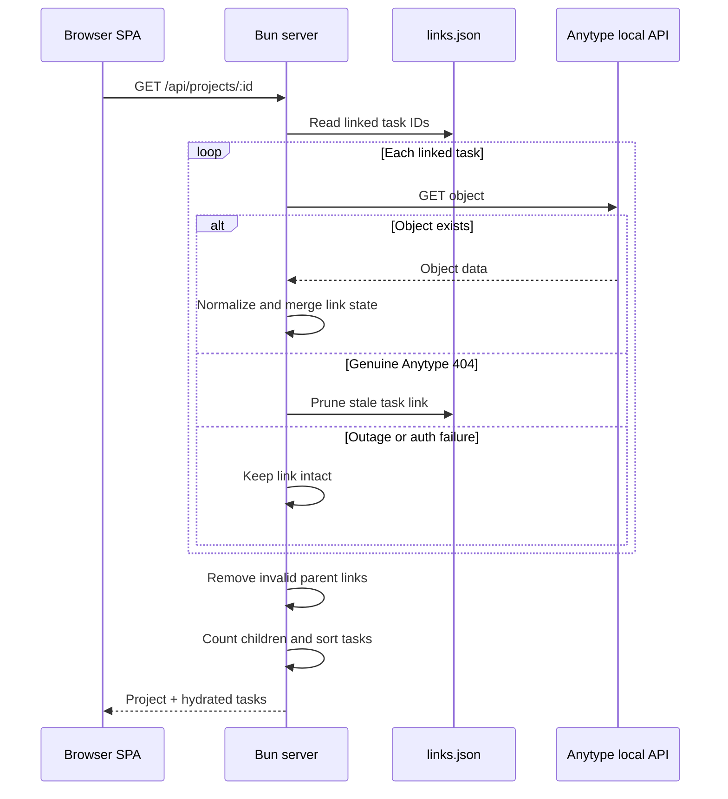

Only a genuine Anytype `404` removes a stale link. Authentication errors and outages do not erase relationships. If a parent task disappeared or belongs to another project, its children are unnested rather than orphaned.

---

## 9. Prerequisite nesting

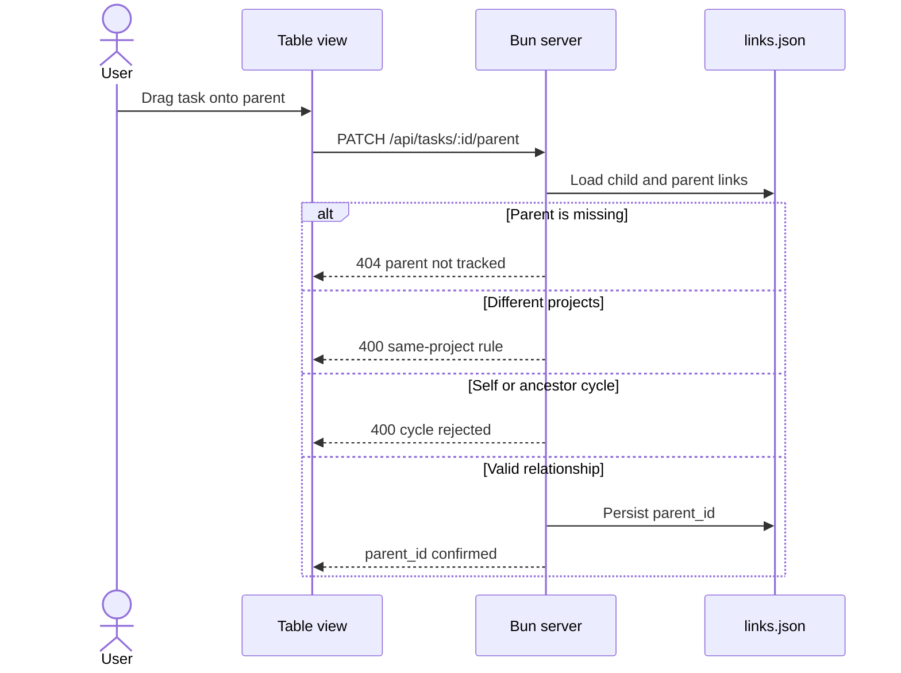

`wouldCycle()` walks upward from the proposed parent while retaining the child ID in a visited set. This rejects both self-parenting and ancestor cycles. Parentage is metadata in `links.json`; it does not change the Anytype task object.

---

## 10. ClickUp manual two-way sync

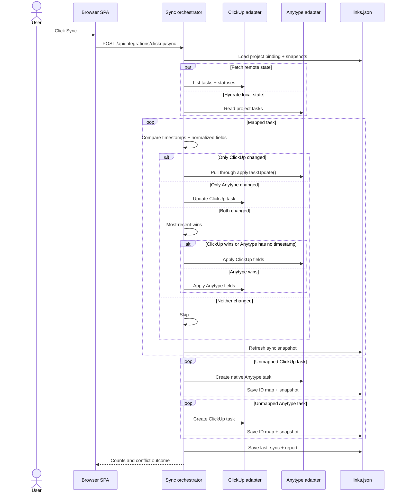

### Sync policy

- **Trigger:** manual only; there is no background polling or writer.
- **Binding:** one ClickUp list is bound per Ascent project.
- **Change detection:** compare ClickUp `date_updated`, Anytype `updated_at`, and normalized fields retained in `CuSyncFields`.
- **Conflict rule:** the most recently updated side wins; ClickUp wins when Anytype has no usable timestamp.
- **Status mapping:** ClickUp workflow names/types map to `backlog`, `in_progress`, `review`, or `done`; reverse mapping chooses a valid list status.
- **Creation:** unmapped tasks are created on the opposite side and receive a baseline snapshot.
- **Deletion:** never propagated. Missing mapped tasks are reported and left untouched on the surviving side.
- **Deduplication:** `clickup.tasks` maps ClickUp IDs to Anytype IDs across restarts and reconnects.

---

## 11. Starred-email synchronization

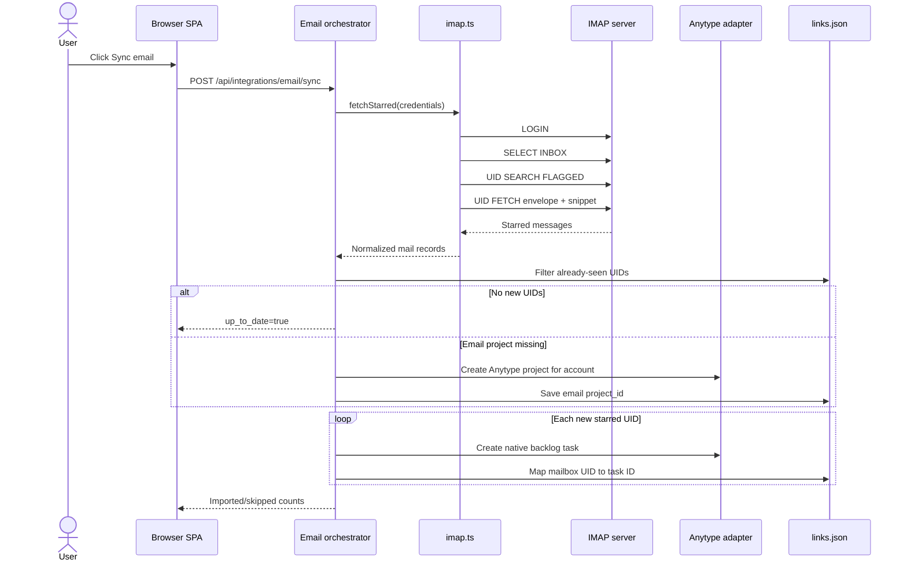

The IMAP adapter is a purpose-built Bun socket client. It uses implicit TLS by default, logs in, selects `INBOX`, searches for `\Flagged`, fetches envelopes, and retrieves a best-effort 2,048-byte text snippet. Mailbox UIDs provide durable deduplication. Disconnecting clears credentials but retains the email project, imported tasks, and UID map.

---

## 12. Wiki flow

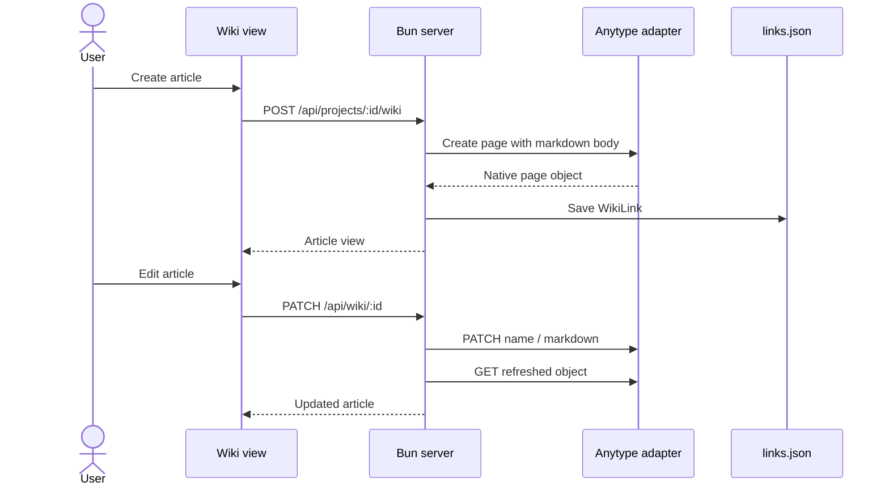

Wiki articles are native Anytype pages. The local wiki link stores only project membership, source, and added timestamp.

---

## 13. Backend invariants

1. **Anytype is the content authority.** Ascent does not duplicate project, task, or article bodies in local state.
2. **A linked task belongs to one Ascent project.** The project relationship is represented by `TaskLink.project_id`.
3. **A prerequisite parent must be tracked in the same project.** Self-links and ancestor cycles are invalid.
4. **Imported objects are preserved.** Removing them from Ascent unlinks them rather than deleting their Anytype object.
5. **Upstream outages must not destroy links.** Automatic pruning occurs only after a confirmed Anytype `404`.
6. **Integration credentials remain server-side.** GET responses expose status and account labels, not secrets.
7. **ClickUp synchronization is explicit and non-destructive.** It runs only on request and never propagates deletion.
8. **Email import is idempotent per mailbox UID.** Repeated syncs do not create duplicate tasks.
9. **Task writes converge through shared paths.** Manual edits and integration-driven updates use the same creation/update rules.
10. **Status has two layers.** Anytype owns the done checkbox; Ascent owns the four-column workflow state and derives the effective status from both.

---

## 14. Security and failure model

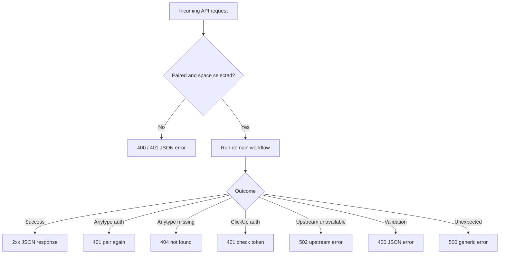

### Trust boundaries

- The browser is not trusted with integration secrets; all provider calls are proxied.
- Credentials are persisted unencrypted in gitignored local JSON files, so host filesystem permissions and disk security remain operational requirements.
- The Anytype base URL is configurable, but the default is local loopback.
- IMAP uses TLS unless the adapter's test-only `secure: false` option is supplied.
- ClickUp calls use HTTPS and send the personal token in the `Authorization` header.

---

## 15. Module dependency summary

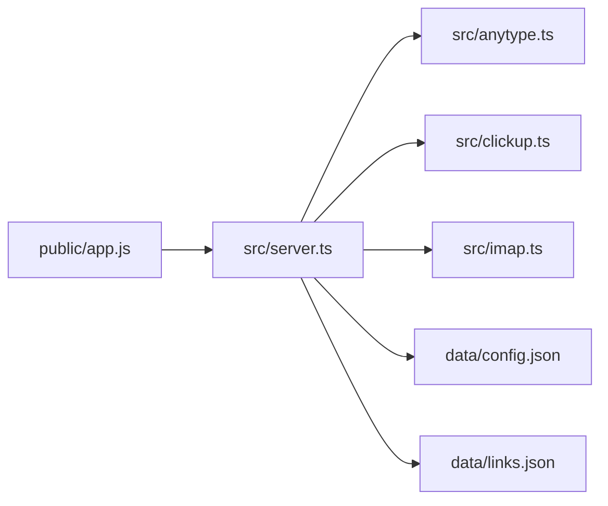

The design is intentionally monolithic at the process level and modular at the protocol boundary: one Bun server coordinates workflows, while separate adapters isolate Anytype HTTP, ClickUp HTTP, and IMAP socket behavior.
